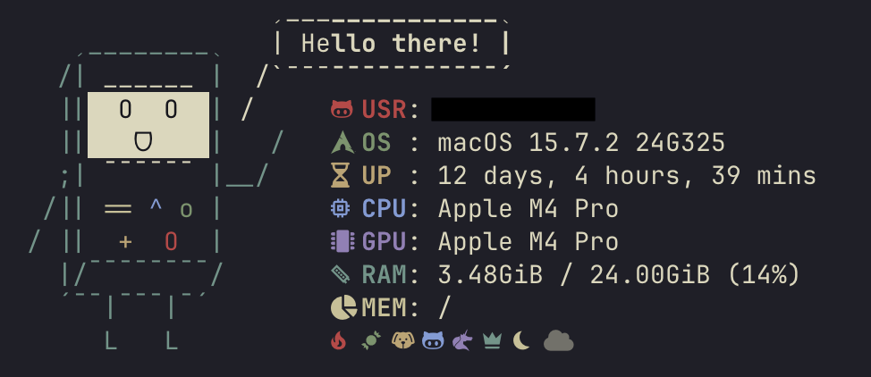

# ⚡️ macOS Dotfiles

This repository hosts my personal development environment configuration for macOS. It is built around **Zsh**, **Neovim**, and **Ghostty**, using **Zinit** to manage plugins efficiently.



## 🛠 My Tech Stack

Here are the core tools and CLIs I use in my daily workflow:

### Core System

- **OS**: macOS

- **Terminal**: [Ghostty](https://github.com/ghostty-org/ghostty)

- **Shell**: Zsh (managed with [Zinit](https://github.com/zdharma-continuum/zinit))

- **Prompt**: [Starship](https://starship.rs/)

- **Editor**: [Neovim](https://neovim.io/) ([LazyVim](https://www.lazyvim.org/) distribution)

- **Font**: Nerd Fonts (Required for icons)

### Core Utilities

I have replaced many standard Unix commands with modern Rust-based alternatives for better performance and visuals.

|                        Tool                         |           Description           |    Replaced    |
| :-------------------------------------------------: | :-----------------------------: | :------------: |
|        [bat](https://github.com/sharkdp/bat)        | Syntax highlighted file reading |     `cat`      |
|        [duf](https://github.com/muesli/duf)         |     Disk Usage/Free Utility     |      `df`      |
|     [tldr](https://github.com/tldr-pages/tldr)      |   Fast implementation of tldr   |     `man`      |
|   [zoxide](https://github.com/ajeetdsouza/zoxide)   |       Smarter cd command        |      `cd`      |
|       [fzf](https://github.com/junegunn/fzf)        |    Command-line fuzzy finder    |     search     |
|      [atuin](https://github.com/atuinsh/atuin)      |      Magical shell history      |   `history`    |
| [topgrade](https://github.com/topgrade-rs/topgrade) |       Upgrade everything        | manual updates |
| [neofetch](https://github.com/dylanaraps/neofetch)  |     System information tool     |                |

### Languages & Frameworks

- **Java**: OpenJDK 17

- **Node.js**: Managed via nvm

- **Big Data**: Apache Spark

- **Cloud/AI**: Google Cloud SDK, LM Studio CLI

## 🚀 Installation

### 1. Prerequisites

Ensure you have [Homebrew](https://brew.sh/) and `git` installed:

```bash
/bin/bash -c "$(curl -fsSL [https://raw.githubusercontent.com/Homebrew/install/HEAD/install.sh](https://raw.githubusercontent.com/Homebrew/install/HEAD/install.sh))"
```

### 2. Install Dependencies

This command installs all binary dependencies required by my `.zshrc`:

```bash
# Core Tools & CLI Enhancements
brew install neovim starship zoxide fzf bat duf tealdeer topgrade atuin neofetch openssl

# Languages & Frameworks
brew install openjdk@17 apache-spark

# Note: NVM and Zinit are handled automatically by the .zshrc script if missing.
```

### 3. Setup Dotfiles

The setup should be handle by the `stow_script`. Ensure that you backup your configuration before.

```bash
# 1. Clone repository
git clone https://github.com/olefSch/dotfiles.git ~/dotfiles

# 2. go into it
cd ~/dotfiles

# 3. Run the stow setup script
chmod +x stow_script.sh
./stow_script.sh
```

## ⌨️ Keybindings & Aliases

### Shell Aliases

I use these aliases to map standard commands to their modern equivalents:

| Alias       | Command            | Description                         |
| :---------- | :----------------- | :---------------------------------- |
| `cat`       | `bat`              | Syntax highlighted file reading     |
| `df`        | `duf`              | Visual disk usage                   |
| `man`       | `tldr`             | Simplified man pages                |
| `ls`        | `ls --color`       | Colored directory listing           |
| `update`    | `topgrade`         | Updates system, brew, plugins, etc. |
| `v` / `vim` | `nvim`             | Opens Neovim                        |
| `cd`        | `z`                | Smart directory jumping             |
| `f`         | `fzf --preview...` | File fuzzy finder with preview      |

### Zsh Keybinds

| Key          | Action                                 |
| :----------- | :------------------------------------- |
| `Ctrl` + `f` | **Accept Autosuggestion** (Ghost text) |
| `Ctrl` + `k` | History Search Up                      |
| `Ctrl` + `j` | History Search Down                    |

## 📂 Structure

The repository is organized into packages for **GNU Stow**:

```
~/dotfiles/
├── stow_script.sh           # Stow automation script
├── zsh/                 # Shell configuration
│   └── .zshrc
├── nvim/                # Neovim config (stowed to ~/.config/nvim)
├── starship/            # Prompt config (stowed to ~/.config/starship)
├── ghostty/             # Terminal config (stowed to ~/.config/ghostty)
└── ...                  # Other packages (atuin, neofetch, etc.)
```

## ⚙️ Configuration Notes

- **Environment Variables**: I use a `.env` file in `$HOME` for sensitive tokens. The `.zshrc` automatically loads this.

- **Java**: `JAVA_HOME` is set to OpenJDK 17 via Homebrew.
